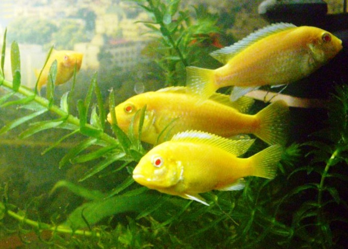

# DeepDream - made simple
### Basic principles of DeepDream

In this notebook we implement a minimal implementation of DeepDream, which is originally described in this [blog post](https://ai.googleblog.com/2015/06/inceptionism-going-deeper-into-neural.html) by Alexander Mordvintsev. Please  have a look into this document in order to get some initial understanding. 

There is a lot of - more or less complicated - DeepDream implementations available, but in this notebook I wanted to provide an  absolutely minimal implementation in order to present the technical idea behind DeepDream. Despite the minimalism the algorithm still produces nice results. Feel free to expand the implementation in whatever direction you like. There are a lot of possibilities (octaves, etc.) and inspirations you will get on GitHub and other places.

The dreaming works basically as follows: 

* By using a pre-trained network there are lot of optical patterns, which the network has learned and which are memorized in the "subconsciousness" of the network. (We are using a VGG19 network here, which was trained on ImageNet. Because there were lots of animals in the original training classes, there are also lots of weird dog, fish and reptile faces (beneath other stuff) in the "subconsciousness" of the deeper layers of the network. (We are using the 28th layer out of the 43 layers of VGG19 for the "pattern recognition").
* The modification of the image is done by forwarding the image through the network, then "echoing" the loss back to the image and calculating the gradient of the image with respect to the activations of a particular layer (the 28th layer in our case). The image is then modified to increase these activations, enhancing the patterns seen by the network, and resulting in a dream-like image. 

The following image shows the DeepDream result of the original image above (taken from https://commons.wikimedia.org/wiki/File:Labidochromis_Caeruleus_Albino_01.JPG).

As you can see, different patterns are "interpreted into" the flora and fauna based on the patterns the VGG19 network has learned before.

### Technical Preconditions
There are the following basic preconditions for running this notebook:
* Pytorch has to be installed (see https://pytorch.org/  for the installation notes)
* The usage of a GPU is highly recommened. (For small images also a CPU "might do it")   
